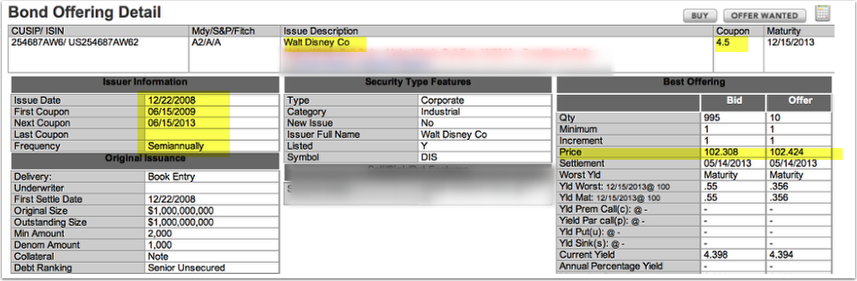

  
## Long-term bond terminology

* Interest rate in bond agreement (indenture):   **stated, coupon, nominal rate**
* **Face value** **(fv)** :   par value, principal amount, maturity value
* **Effective interest rate** (market rate) **(i)** :   rate of interest earned by bond holders
* Par:  bond sells for face amount (stated rate $=$ effective interest rate)
* **Discount**:   bond sells for less than face value (stated rate $\lt$ effective interest rate)
* **Premium**:   bond sells for more than face value (stated rate $\gt$ effective interest rate)
* **Interest payments (pmt)** :  stated rate $\times$ face

--- &radio .quiz

## Q: discount or premium

For a bond issue that sells for less than its face value, the effective interest rate of interest is

1.  _Higher than the rate stated on the bond_
2.  Dependent on the rate stated on the bond
3.  Equal to the rate stated on the bond
4.  Less than the rate stated on the bond 

*** .explanation

get less (discount) because pay less (stated rate $\lt$ effective rate of interest for borrowings with similar risk profiles 

---

## Price of a bond

On 2013-02-01, ABC issued 4% bonds, with a face amount of  10000. The bonds mature on 2015-2-1. The effective interest rate for similar bonds is 5%. Interest is paid semiannually on Feb  and Aug 1. XYZ acquired the bonds as a long-term investment.

* Price = PV(0.025, 4, -200, -10000) = 9811.90 
    * Price = PV(rate,nper,pmt,[fv],[type])
        * rate = effective rate / number of compounding periods per year = 0.05 / 2 = 0.025
        * nper = number of years x number of compounding periods per year = 2 x 2 = 4
        * pmt = - stated rate / number of compounding periods per year x face amount
            * = -0.04 /2 x 10000 = -200
        * fv  =  -10000
        * type = 0 ordinary annuity (payments at end of period)

--- &radio .quiz

## Q:  bond measurement

The market price of a bond issued at a discount is the present value of its principal amount at the effective rate of interest

1.   Less the present value of all future interest payments at the rate of interest stated on the bond
2.   Plus the present value of all future interest payments at the rate of interest stated on the bond
3.   _Plus the present value of all future interest payments at the effective rate of interest_
4.   Less the present value of all future interest payments at the market effective rate of interest

--- &radio .quiz

## Q: bond price

On 2013-04-01, ABC issued 6% bonds, with a face amount of 1000. The bonds mature on 2018-4-1 . Yield  is 4%. Interest is paid semiannually on Apr and Oct 1. The issuance price for the bonds is: 

1.  1099.83
2.  1079.83
3.  1094.83
4.  _1089.83_

*** .explanation

Price = PV(0.02,10,-30,-1000)=1089.83 

---

## Bond issued at a discount

Issue of 800 at 97 (97 percent of par)

 

**Issuance**               |                                                  | DR              |  CR 
---------------------------|--------------------------------------------------|-----------------|-----------
                           |  Cash         (800 x .97)                        |     776         |         
                           |  Discount on Bond payable (xl) (800 - 76)        |      24         |
                           |  Bond payable                                    |                 |   800         
**AMORTIZE BOND DISCOUNT** |                                                  |                 |            
                           |  Interest expense                                |         x       |               
                           |  Discount on Bond payable (xl)                   |                 |   x
                           
  

--- 

## Bond issued at a premium 

Issue of 800 at 101 (101 percent of par)

 

 **Issuance**              |                                             | DR              |  CR 
---------------------------|---------------------------------------------|-----------------|--------------
                           | Cash          (800 x 1.01)                  |    808          |         
                           | Premium on Bond payable (l) (808 - 800))    |                 |     8
                           | Bond payable                                |                 |   800         
                           |                                             |                 |            
**AMORTIZE BOND PREMIUM**  |                                             |                 |
                           | Premium on Bond payable (l)                 |       x         |   
                           | Interest expense                            |                 |   x            

---

## Ex: Disney bond

*  Coupon (stated rate) = 4.5% 
*  Interest payment (semi-annual) for 1000 par = $\frac{.045}{2}\times1000=22.5$
    *  Price to buy is 102.434.  Cost 1000 bond $=1000\times102.434=1024.34$
*  Is bond selling for a discount of a premium?
     

--- 

## Amortization schedule- effective method

On 2013-02-01, ABC issued 4% bonds, with a face amount of  10000. Bonds mature on 2015-2-1. Effective yield for the bonds is 5%. Interest is paid semiannually on Feb  and Aug 1. 

   Date (t)         | a: Int Exp                | b: Payment   |    c: Diff (a-b)             |    d: Bal=CV 
--------------------|---------------------------|--------------|------------------------------|-----------------
2013-02-01            |                           |              |                              |    9811.9
2013-8-1            |   245.3     |   200    |     45.3  |    9857.2   
2014-2-1           |   246.43     |   200    |     46.43  |    9903.63
2014-8-1          |   247.59     |   200    |     47.59  |    9951.22
2015-2-1          |   248.78     |   200    |     48.78  |  10000 

 

- A = $9811.9\times \frac{0.05}{2}= 245.3$ 
- B = $10000\times\frac{0.04}{2}=200$
- D = $\text{Bal}_{t-1}+ \text{Diff}=9811.9+45.3=9857.2$

--- 

##  JE effective interest rate method: ABC issuer

 

Issuance: 2013-02-01                      |                                     | DR                    |  CR 
----------------------------------------|-------------------------------------------------|-----------------------|-------------
                                        | Cash                                            |    9811.9           |         
                                        | Discount on Bond payable (xl) (=face-price)     |  188.1        |   
                                        | Bond payable                                    |                       | 10000
 **INTEREST PAYMENT 2013-8-1**         |                                                 |                       |            
                                        | Interest expense                                |  245.3  |
                                        | Cash                                            |                       |    200
                                        | Discount on Bond payable (xl)                   |                       |   45.3
                                        
  

--- 

##  JE effective interest rate method: ABC issuer

EOY interest accrual: 2013-12-31          |                                         | DR                |  CR 
-----------------------------------------|-----------------------------------------|-------------------|-------------------
                                         |  Interest expense                       | 205.36 (a)   |
                                         |  Interest payable                       |                   |   166.67(b)
                                         |  Discount on Bond payable (xl)          |                   |   38.69 (c)
**INTEREST PAYMENT 2014-2-1**          |                                         |                   |  
                                         |  Interest payable                       |  166.67      | 
                                         |  Interest expense                       |  41.07      |
                                         |  Cash                                   |                   |   200
                                         |  Discount on Bond payable (xl)          |                   |   7.74
                                         
 
- (a) $205.36= 246.43\times \frac{5}{6}$ 
- (b) $166.67=200\times \frac{5}{6}$ 
- (c) $38.69=46.43\times \frac{5}{6}$

--- 

## JE effective interest rate method: XYZ investor 

* Assume investor has intent and ability to hold to maturity.  Investment accounted for using amortized cost method

 

Issuance: 2013-02-01                      |                                        | DR                     |  CR 
----------------------------------------|----------------------------------------|------------------------|-----------------------
                                        | Bond receivable  (a)                   |10000.00|            
                                        | Cash                                   |                        |    9811.9     
                                        | Discount on bond receivable (xa)       |                        |   188.1
**INTEREST RECEIVED 2013-8-1**         |                                        |                        |            
                                        | Interest revenue                       |                        |   245.3
                                        | Cash                                   |  200               |   
                                        | Discount on Bond payable (xa)          | 45.3|  
  

--- 

## JE effective interest rate method: XYZ investor 

  

EOY interest accrual: 2013-12-31         |                                       | DR                |  CR 
----------------------------------------|---------------------------------------|-------------------|-----------------
                                        |  Interest revenue                     |                   |    205.36
                                        |  Interest receivable (a)              | 166.67       |   
                                        |  Discount on bond receivable (xa)     | 38.69       |   
**INTEREST REVENUE 2014-2-1**         |                                       |                   |  
                                        |  Interest receivable                  |                   |  166.67       
                                        |  Interest revenue                     |                   |  41.07
                                        |  Cash                                 | 200  |   
                                        |  Discount on bond receivable (xa)     | 7.74       |   
                                        
  

---

## Amortization schedule- straight line method

On 2013-02-01, ABC issued 4% bonds, with a face amount of  10000. Bonds mature on 2015-2-1. Market yield for bonds is 5%. Interest is paid semiannually on Feb  and Aug 1. 

   Date (t)         | a: Payment   |    b: Diff              | c: Int Exp (a+b)   |    d: Bal=CV 
--------------------|--------------|-------------------------|--------------------|----------------------
2013-02-01            |              |                         |                    |  9811.9 
2013-8-1            |   200    |     47.03  |   247.03 |  9858.925    
2014-2-1          |   200    |     47.03  |   247.03 |  9905.95 
2014-8-1          |   200    |     47.03  |   247.03 |  9952.975 
2015-2-1         |   200    |     47.03  |   247.03 |  10000   

 

- A  = $10000\times\frac{0.04}{2}$ =200
- B  = $\frac{ 10000-9811.9}{4}$ =47.03 
- D  = $\text{Bal}_{t-1}+\text{Diff}$

---

##  JE straight line method: ABC issuer

  

 Issuance: 2013-02-01                    |                                                 | DR                    |  CR 
---------------------------------------|-------------------------------------------------|-----------------------|-----------------------
                                       | Cash                                            |    9811.9           |         
                                       | Discount on Bond payable (xl)                   |  188.1        |   
                                       | Bond payable                                    |                       | 10000
**INTEREST PAYMENT 2013-8-1**         |                                                 |                       |            
                                       | Interest expense                                |  247.03     |
                                       | Cash                                            |                       |    200
                                       | Discount on Bond payable (xl)                   |                       |   47.03
  
  

---

##  JE straight line method: ABC issuer

     EOY interest accrual: 2013-12-31      |                                    | DR                |  CR 
-----------------------------------------|------------------------------------|-------------------|-------------------
                                         |  Interest expense                  | 205.85 (a)   |
                                         |  Interest payable                  |                   |   166.67(b)
                                         |  Discount on Bond payable (xl)     |                   |   39.19 (c)
**INTEREST PAYMENT 2014-2-1**          |                                    |                   |  
                                         |  Interest payable                  |  166.67      | 
                                         |  Interest expense                  |  41.18      |
                                         |  Cash                              |                   |   200
                                         |  Discount on Bond payable (xl)     |                   |   7.84
                                    
 
- (a) $205.85= 247.03\times \frac{5}{6}$
- (b) $166.67 = 200\times \frac{5}{6}$
- (c) $39.19=47.03\times \frac{5}{6}$

--- 

## Borrowing issuance costs

* U.S. GAAP and IFRS
  * Reduce recorded amount of the debt by the debt issuance costs 
  * Lower (net) amount is borrowed at the same cost, increasing the effective interest rate

--- &radio .quiz

## Q: issuance costs

When bonds and other debt securities are issued, payments such as legal costs, printing costs, and underwriting fees, are referred to as debt issuance costs (called transaction costs under IFRS). ABC  prepares its financial statements using IFRS.

1. the recorded amount of the debt is increased by the transaction costs
2. the decrease in the effective interest rate caused by the transaction costs is reflected in the interest expense
3. the transaction costs are recorded separately as an asset
4. _the increase in the effective interest rate caused by the transaction costs is reflected in the interest expense_

---

## Extinguishment of debt

* Net carrying value (CV)= face + unamortized premium- unamortized discount - unamortized issue costs
  * Consideration given $\lt$ CV $\rightarrow$ gain
  * Consideration given $\gt$ CV $\rightarrow$ loss
  

--- &radio .quiz

## Gain/loss extinguishment debt

On 2013-06-30, ABC Co. had outstanding 8%,   10000 face value bonds maturing on 2019-6-30. Interest was payable semiannually every Jun 30 and Dec 31. On 2013-06-30, after amortization was recorded for the period, the unamortized bond discount and bond issuance costs were 150 and 170, respectively. On that date, ABC acquired all its outstanding bonds on the open market at 100 percent of par (face) and retired them. On 2013-06-30 ABC should recognize the following as gain/(loss) before income taxes on redemption of bonds:

1.  -330
4.  _-320_
2.  -340
3.  -350

*** .explanation

gain/(loss) = CV - consideration given 
- = (10000-150-170) - 1 x  10000

--- 

## US vs. IFRS: convertible debt at issuance

*  **US** the entire issue price is recorded as debt
*  **IFRS** convertible debt is divided into its liability and equity elements
   *  Paid-in capital for the portion of the proceeds attributable to the conversion feature and liability for the balance

--- &radio .quiz

## Q: convertible debt IFRS

On May 1, 2013, ABC issued 10-year convertible bonds at 103. During 2015, the bonds were converted into common stock. ABC prepares its financial statements according to IFRS. On May 1, 2013, cash proceeds from the issuance of the convertible bonds should be reported as

1. A liability for the entire proceeds
2.  Paid-in capital for the entire proceeds
3. _Paid-in capital for the portion of the proceeds attributable to the conversion feature and as a liability for the balance_
4.  A liability for the face amount of the bonds and paid-in capital for the premium over the par value

*** .explanation

Under US GAAP, the entire issue price is recorded as debt. Under IFRS, convertible debt is divided into its liability and equity elements.

--- 

## Convertible debt

* Two methods to record conversion
  * Book value method
  * Market value method

---   

## Conversion debt - book value method

* No gain or loss
* Plug for common stock

  

 Issuance 8 1000 at 97        |                                                           | DR               |  CR 
----------------------------------------------------|-----------------------------------------------------------|------------------|------------------
                                                    |  Cash  $8\times 1000\times97$      |  7760       |
                                                    |  Discount on bond payable (xl)                            |    240       |
                                                    |  Convertible bond payable                                 |                  |   8000         
**CONVERSION (UNAMORTIZED DISCOUNT IS 72)**  |                                                           |                  |
                                                    | Convertible bond payable                                  |    8000      | 
                                                    | Discount on bond payable (xl)                             |                  |   72     
                                                    |   Common stock (plug)                                     |                  |   7928                                                 
                                                    
  

---   

## Conversion debt - market value method

* Unamortized discount 72
* Stock price 6
* Conversion rate 150 shares for each 1000 bond

Issuance 8 1000 at 97        |                                                                                     |   DR             |  CR 
----------------------------------------------------|-------------------------------------------------------------------------------------|------------------|---------------
                                                    |  Cash  $8\times 1000\times97$                                |  7760       |
                                                    |  Discount on bond payable (xl)                                                      |    240       |
                                                    |  Convertible bond payable                                                           |                  |   8000         
**CONVERSION (UNAMT DIS = 72)**              |                                                                                     |                  |
                                                    |  Convertible bond payable                                                           |     8000     |  
                                                    |  Discount on bond payable (xl)                                                      |                  |   72
                                                    |  Common stock (no of share/bond $\times$ number of bonds $\times$ stock price)      |                  |  7200
                                                    |  Gain/loss on conversion   (plug)                                                   |                  |  728

--- &radio .quiz

## Q:  conversion market value method

On, 2013-02-01, ABC Corp. had outstanding 8%, 7000 face amount, convertible bonds maturing on 2019-2-1. 
Interest is payable on Feb and Aug. On 2013-02-01, all these bonds were converted into 78 shares per 1000 face amount of bond.  The stock price on 2013-02-01 was 17. On the date of conversion: Unamortized bond discount was 126. The amount of gain/(loss) that should be recognized from the conversion using the market value method is: 

  1.   0
  2.  6874
  3.  2282
  4.  _-2408_

*** .explanation

- (face- unamortized discount) - proceeds cs 
    - proceeds cs = conv x nbonds x stock price  
- -2408 = (7000 - 126) - 78 x 7 x 17

--- &radio .quiz

## Q:  conversion book value method

On, 2013-02-01, ABC Corp. had outstanding 8%, 7000 face amount, convertible bonds maturing on 2019-2-1. 
Interest is payable on Feb and Aug. On 2013-02-01, all these bonds were converted into 78 shares per 1000 face amount of bond.  The stock price on 2013-02-01 was 17. On the date of conversion: Unamortized bond discount was 126. The amount of gain/(loss) that should be recognized from the conversion using the book value method is: 

  1.   _0_
  2.  6874
  3.  2282
  4.  -2408

*** .explanation

book value method, no gain or loss is recognized

--- 

## Bonds with detachable warrants to buy stock

* Separate FV of bonds and warrants using relative market value approach

  

                                           | DR                              |  CR 
-------------------------------------------|---------------------------------|--------------------------------
  Cash                                     |       x                         | 
   Bonds payable (net)                     |                                 |     x
   Equity - stock warrants                 |                                 |     x

  

--- &radio .quiz

## Q: detachable warrants

ABC issued bonds with a face amount of  20000. Each 1000 bond contained detachable stock warrants for 100 shares of ABC's common stock. Total proceeds from the issue amounted to  21820. The market value of each warrant was 3, and the market value of each bonds without the warrants was 840.  Value allocated to bonds and to warrant:

1.   _16077.89 and 5742.11_
2.  16027.89 and 5792.11
3.  16112.89 and 5707.11
4.  16127.89 and 5692.11

*** .explanation

- bonds = $\frac{840}{840+300}$ x 21820.00 
   - = 1.607789 &times; 104
- warrants = $\frac{300}{840+300}$ x 21820.00 
   - = 5742.11

---

## Disclosure

*  Fair value
*  Interest rates
*  Maturity dates
*  Call provisions
*  Conversion options
*  Restrictions imposed by creditors
*  Assets pledged as collateral

---

## Elect FV option for financial liabilities

* Report changes in fair value in the income statement
  * FV =500
  * CV =400
  * adjustment =100
  
  

                                           | DR                              |  CR 
-------------------------------------------|---------------------------------|--------------------------------
  Unrealized holding loss                  |     100                         | 
  Fair value adjustment bond payable (l)   |                                 |   100  

  

